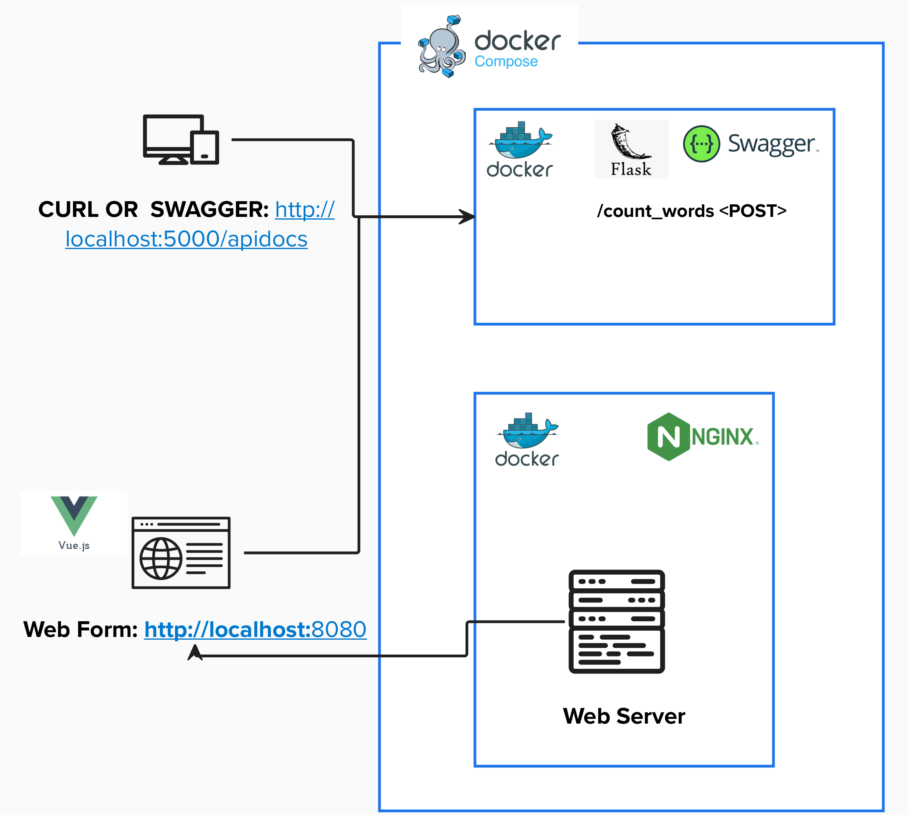
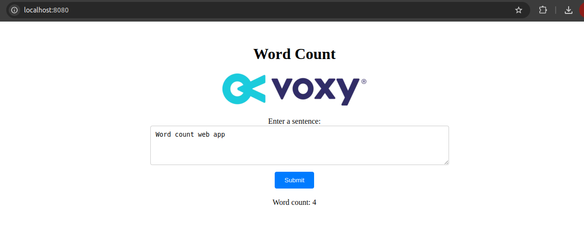

# Word Count Web App

[](https://www.python.org/downloads/)
[](https://vuejs.org/)
[](https://nodejs.org/en/download/)


Count the words in a sentence. It features a front-end application that communicates with
a back-end service responsible for processing requests to count the words.

---

## Definition of Word

According to the [Collins Dictionary](https://www.collinsdictionary.com/dictionary/english/word), a word is:

> **"b. a letter or group of letters representing such a unit of language, _written or printed usually in solid or hyphenated form_."**

**Note:** There is not a canonical definition of what character group can be considered a word.

For this exercise, a **"word"** is defined as any grouping of characters that matches the Regex `\w` meta-character.
- **(For ASCII, word characters are:** `[a-zA-Z0-9_]`)
- Additionally, **apostrophes (`'`) and hyphens (`-`)** are included in the definition.

### Examples:
- **"state-of-the-art"** → _considered 1 word_
- **"don't"** → _considered 1 word_

---

## System Architecture



---

## Tech Features

- **Containerized Architecture**: Encapsulates all application logic in Docker containers through docker-compose.
- **Testing Framework**: Unit tests created with pytest.
- **Api Endpoints**: Expose endpoint for word count (Flask).
- **Front End Application**: Web Form for word count (Vue.js).
- **Swagger Documentation**: Exposes API documentation and a request execution environment (client) in Swagger format.

---

## Getting Started

### Prerequisites

Before running this project, ensure you have the following installed:

- **Python 3.10.12**
  ```bash
  $ python3 --version
  ```
- **Node v18.19.1**
  ```bash
  $ node --version
  ```
- **Docker 27.0.0**
  ```bash
  $ docker --version
  ```
- **Docker Compose v2.20.3**
  ```bash
  $ docker-compose --version
  ```

---

### Installation

1. Clone the repository:
   ```bash
   $ git clone git@github.com:mauriciocoder/word_count.git
   $ cd word_count
   ```

2. Set up a Python virtual environment:
   ```bash
   $ python3 -m venv .venv
   $ source .venv/bin/activate
   ```

3. Install the required Python packages:
   ```bash
   $ pip install -r requirements.txt
   ```

4. Copy the environment variables file and configure:
   ```bash
   $ cp .env.sample .env
   ```
   - Adjust environment variables as needed.

5. Run all unit tests to verify the setup:
   ```bash
   $ pytest .
   ```

6. Set up pre-commit hooks:
   ```bash
   # Install the hooks to run automatically on `git commit`:
   $ pre-commit install

   # Run pre-commit manually:
   $ pre-commit run --all-files
   ```

8. Install front-end dependencies:
   ```bash
   $ npm install
   ```

7. Build and start the application using Docker Compose:
   ```bash
   $ sudo docker-compose up --build
   ```

Then, the following services will be available:
- **Flask:** [http://localhost:5000](http://localhost:5000)
- **Swagger:** [http://localhost:5000/apidocs/](http://localhost:5000/apidocs/)
- **Web Form:** [http://localhost:8080/](http://localhost:8080/)

---

### Usage

#### Web Form:



---

## Refactoring & Known Issues

- **Python Dependencies**: Requirements file is exposing all dependencies from venv, which is not ideal.
- **Endpoint Security**: API endpoints are exposed to the public.
- **Front End Templating**: Front-end templating is not ideal. Scripts, styles and markup are placed in the same file.
- **Single .env File**: Both API and front-end use the same .env file.
- **Pre-commit**: Pre-commit hooks for linting are only applied for backend files. Front-end files are not affected.
- **Front End Unit Tests**: Unit tests created for API and word count logic. Front-end unit tests were not included.
- **CI/CD**: No CI/CD pipeline was created for multiple environments.

---
